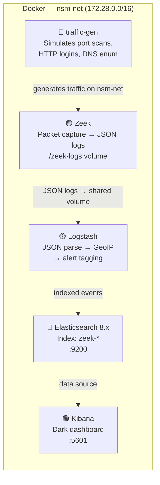

# Network Security Monitoring (NSM) Stack

[](https://docker.com)
[](https://zeek.org)
[](https://elastic.co)
[](https://elastic.co/kibana)

A fully-containerised **Network Security Monitoring (NSM)** stack for local traffic analysis. Captures network events with **Zeek**, enriches and indexes them through **Logstash**, and visualises them in a dark-themed **Kibana** dashboard — all in Docker with a single command.

---

## Architecture



## Services

| Service | Image | Port | Role |
|---|---|---|---|
| `elasticsearch` | `elasticsearch:8.13.4` | `9200` | Data store |
| `kibana` | `kibana:8.13.4` | `5601` | Dashboard UI |
| `logstash` | `logstash:8.13.4` | — | Ingestion & enrichment |
| `zeek` | custom (zeekurity/zeek) | — | Packet capture → JSON |
| `traffic-gen` | custom (python:3.12-slim) | — | Simulated attack traffic |

---

## Quick Start

### Prerequisites
- Docker Desktop 4.x+ (Windows/Mac) or Docker Engine 24+ (Linux)
- Docker Compose v2.x
- 4 GB RAM allocated to Docker (8 GB recommended)
- Ports `9200` and `5601` free on `localhost`

### 1. Clone & Start

```bash
git clone https://github.com/your-username/Network-Security-Monitoring-Stack-NSM-.git
cd Network-Security-Monitoring-Stack-NSM-

# Start all services (detached)
docker-compose up -d

# Watch logs
docker-compose logs -f
```

### 2. Import Kibana Dashboards

```bash
# Linux / macOS / WSL2
bash scripts/import_dashboards.sh

# Windows (PowerShell)
# Wait for Kibana at http://localhost:5601 then:
# Stack Management → Saved Objects → Import → kibana/dashboards/nsm_dashboards.ndjson
```

### 3. Open Kibana

Navigate to **[http://localhost:5601](http://localhost:5601)**

- Dashboard: **NSM Security Overview**
- Default time range: **Last 24 hours** (auto-refresh every 10s)

---

## Dashboard Panels

| Panel | Type | Description |
|---|---|---|
| **Active Alerts by Severity** | Radial Gauge | Critical / High / Medium event counts |
| **Global Attack Heatmap** | Vega Map | GeoIP source/dest of traffic on world map |
| **Protocol Distribution** | Doughnut Chart | HTTP, DNS, SSH, TLS breakdown |
| **Alert Timeline (24h)** | Stacked Bar | Alert counts over time, stacked by severity |
| **Top 20 IPs by Traffic** | Data Table | Bytes In/Out, connections, country per IP |
| **Raw Alert Stream** | Discover | Live auto-refreshing alert log |

---

## Simulated Traffic Patterns

The `traffic-gen` container runs `scripts/traffic_gen.py` every 60 seconds, generating:

| Pattern | Detection | Logstash Tag |
|---|---|---|
| TCP SYN port scan (ports 20–1024) | Zeek `Scan::Port_Scan` notice | `port_scan_detected` |
| Cleartext HTTP POST `/login` | Zeek HTTP + Logstash rule | `cleartext_auth_attempt` |
| DNS subdomain enumeration | Zeek DNS high-volume logs | _(high rate in DNS index)_ |
| Rapid SSH connection attempts | Zeek SSH auth failure logs | `ssh_auth_failure` |
| Bulk data transfer | Zeek conn log / large bytes | _(visible in top talkers)_ |

---

## Verification Commands

```bash
# All containers running?
docker-compose ps

# Elasticsearch healthy?
curl http://localhost:9200/_cluster/health?pretty

# Zeek producing logs?
docker-compose exec zeek ls /zeek-logs/

# Data indexed in ES?
curl "http://localhost:9200/zeek-*/_count?pretty"

# Logstash pipeline healthy?
curl http://localhost:9600/?pretty
```

---

## Configuration

| File | Purpose |
|---|---|
| `docker-compose.yml` | Service orchestration |
| `zeek/local.zeek` | Zeek scripts, JSON output, scan thresholds |
| `logstash/pipeline/zeek.conf` | Ingestion pipeline: parse → GeoIP → index |
| `kibana/kibana.yml` | Dark mode, ES connection, default index |
| `kibana/dashboards/nsm_dashboards.ndjson` | All saved Kibana objects |
| `scripts/traffic_gen.py` | Attack simulation script |
| `.agents/rules/security-guide.md` | Security guide for AI agents |

## Security Notes (Local Dev)

> **`xpack.security.enabled=false`** is intentional for local development convenience.
> In production, re-enable it, configure TLS certificates, and set strong credentials.
> See `.agents/rules/security-guide.md` for the full hardening checklist.

---

## Stopping the Stack

```bash
docker-compose down          # Stop services, keep volumes
docker-compose down -v       # Stop + destroy all data
```

---

## License

MIT — see [LICENSE](LICENSE)
